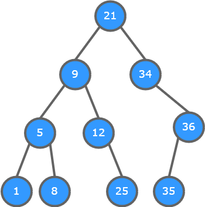
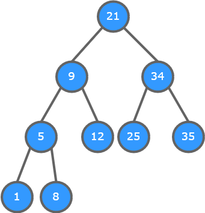
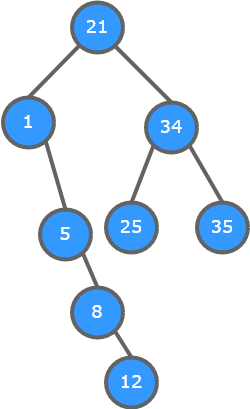

# Description du TP

## 1. Les arbres binaires de recherches (ABR)
Un arbre binaire de recherche est un arbre binaire (chaque nœud a au plus 2 fils) et tel que tout nœud a une
valeur supérieure à l’ensemble des valeurs des nœuds de son sous-arbre gauche et inférieure à l’ensemble des
nœuds de son sous-arbre droit.

### a) INTRODUCTION
- D’après la définition, donner plusieurs exemples d’ABR.
  - **Recherche d'un nombre précis**
  - **???**
- Voyez-vous d’ores et déjà des applications pratiques à cette structure ?
  - **oui**

### b) INSERER
L'insertion d'une valeur dans un arbre binaire est un processus récursif simple. Il suffit tout simplement d'appliquer
la définition d'un arbre binaire de recherche.
- Écrire l’algorithme d’insertion d’un élément dans un arbre binaire de recherche.
```
n = the node's weight
i = the weight to insert

function insert(Node, i){
    if i < n then
        if exist(Node.left) then
            insert(Node.left, i)
        else
            Node.left = create_node(weight = i)
        endif
    else
        if exist(Node.right) then
            insert(Node.right, i)
        else
            Node.right = create_node(weight = i)
        endif
    endif
}  
```
- Donner la complexité de cet algorithme au pire des cas.
  - **Soit n la profondeur maximum de l'arbre.\
    O(insert) = 3n\
    ( 2 comparaisons et 1 affectation par noeud )**
- Construire l’ABR résultant des insertions successives suivantes : `21, 9, 12, 34, 36, 35, 5, 8, 1, 25`
  - 

### c) SUPPRIMER
- Quels sont les différents cas possibles lors de la suppression d’un nœud ?
  - **1) Pas de fils**
  - **2) 1 fils**
  - **3) 2 fils**
- Comment procéder dans chacun des cas pour conserver les propriétés des ABR ?
  - **1) Suppression directe**
  - **2) Remplacement du noeud par son fils**
  - **2) Rotation du noeud (ce qui peut impliquer une rotation du noeud montant), puis remplacement par son fils maintenant unique**
- Supprimer l’élément 36 de l’ABR précédent. Donner l’ABR résultant.
  - 
- Supprimer l’élément 9 de l’ABR précédent. Donner l’ABR résultant.
  - 

### d) PARCOURS
Il existe 3 types de parcours d’un ABR : (attention, les définitions ci-dessous sont données de manière récursive,
autrement dit en considérant à chaque fois le sous-arbre en cours de traitement).
Parcours Infixe

On parcourt dans l'ordre :
* le sous-arbre gauche
* la racine
* le sous-arbre droit

Parcours Préfixe
* la racine
* le sous arbre gauche
* le sous arbre droit

Parcours Postfixe
* le sous arbre gauche
* le sous arbre droit
* la racine

- Donner le parcours infixe de l’ABR réalisé en b)
- Donner le parcours préfixe de ce même ABR
- Donner le parcours postfixe de ce même ABR
- Que pouvez-vous remarquer sur le résultat du parcours infixe ?

### e) IMPLEMENTATION
- Donner une implémentation possible des ABR à l’aide d’un tableau statique.
- Donner une implémentation possible des ABR à l’aide d’une structure plus évoluée.